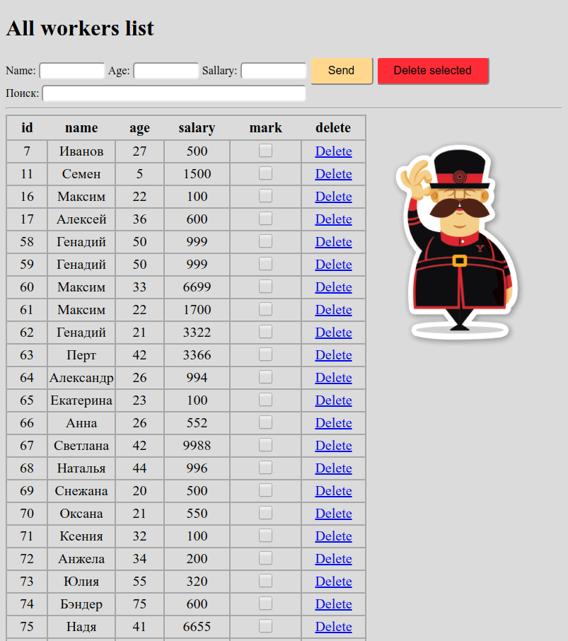
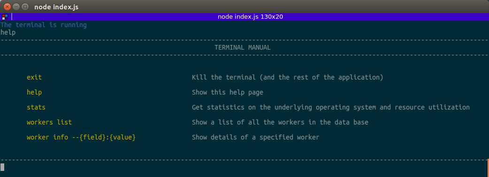
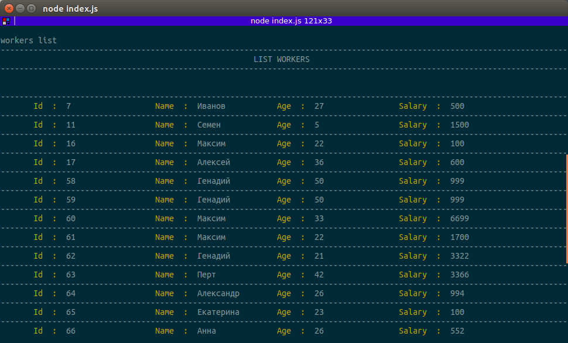
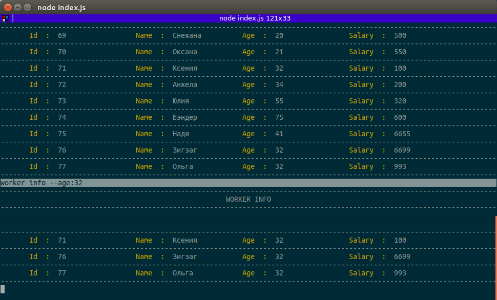

# Table Use NodeJS and MySQL 

Before starting, you need to create a database in MyQSL test->workers

Works for addresses in the browser:
- http://localhost:3000/
- http://localhost:3000/home

	

For other addresses:
- http://localhost:3000/not_found
- http://localhost:3000/404

	

You can work with the terminal

	

	

	

